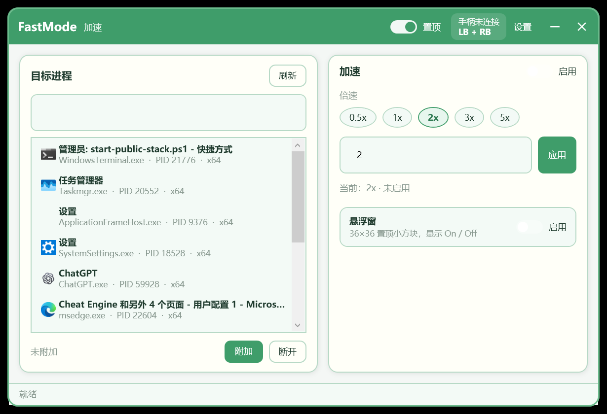

# 游戏倍速工具：单机游戏进程与音频同步变速

搜索关键词：游戏快速模式、游戏倍速工具、单机游戏倍速、单机游戏变速器、游戏进程倍速、游戏音频倍速、游戏进程和音频同步倍速、Windows 游戏倍速、PC 游戏倍速工具、游戏速度调节工具、手柄快捷键切换倍速、键盘快捷键切换倍速。

Search keywords: game fast mode, game speed tool, single-player game speedhack, single-player game speed changer, game process speed changer, game audio speed changer, synchronized game process and audio speed, Windows game speedhack, PC game speed tool, game speed adjustment tool, controller hotkey speed toggle, keyboard hotkey speed toggle.

FastMode is a native Windows speed controller for single-player games: pick any running game and run it at your chosen multiplier — with game audio sped up in sync, and toggle via XInput controller combo or global hotkey. English mode is built in and can be selected at runtime; for the full English documentation, see [README_EN.md](./README_EN.md).

## 项目简介

FastMode 将进程倍速控制整理为一个独立的 Windows 桌面程序。用户可以从具有可见前台窗口的应用列表中选择目标，设置预设或自定义倍速，并通过界面开关、手柄组合键或全局键盘快捷键快速启停。

项目使用原生 WPF 构建，不依赖本地 Web 服务或浏览器端口。界面采用绿色设计语言、自绘圆角窗口壳，并支持在不同 DPI 的显示器之间动态切换和重新渲染。程序默认使用简体中文，点击窗口顶部的中英文切换按钮即可在中文和英文之间即时切换。

## 当前状态

| 项目 | 状态 |
|---|---|
| 当前版本 | `v0.5.0` |
| 操作系统 | Windows 10 / Windows 11 |
| 架构 | x64 |
| 界面语言 | 简体中文 / English（默认中文） |
| 主界面 | 原生 WPF |
| DPI | Per-Monitor V2 |
| 公开下载 | `v0.5.0` 已准备 |

## 主要功能

- 枚举具有可见顶层窗口的应用，并显示应用图标、窗口标题、进程名、PID 和架构。
- 附加或断开目标进程。
- 提供常用倍速预设和自定义倍率输入。
- 使用界面开关启用或关闭倍速。
- 默认使用 `LB + RB` 手柄组合键切换倍速状态。
- 支持在设置页直接选择新的手柄按键组合。
- 默认使用 `Ctrl + F` 全局键盘快捷键切换倍速状态，不会拦截原有键盘输入。
- 支持在设置页通过可视化按键选择修改键盘快捷键；组合必须包含 `Ctrl`、`Shift` 或 `Alt`。
- 支持运行时中英文切换；点击窗口顶部的语言按钮即可切换。
- 支持主窗口置顶和可选的小型置顶状态悬浮窗。
- 启用倍速时默认同步处理目标音频，不提供单独的音频开关。
- 支持跨不同缩放比例的显示器移动，保持文字、图标和圆角边框清晰。

## 界面预览



## 快速开始

1. 解压完整发布包，不要只单独复制 `FastMode.exe`。
2. 运行 `FastMode.exe`。
3. 在“目标进程”列表中选择需要控制的应用。
4. 点击“附加”。
5. 选择预设倍速，或输入自定义倍率后点击“应用”。
6. 打开“启用”开关，按下默认手柄快捷键 `LB + RB`，或按下默认键盘快捷键 `Ctrl + F`。
7. 不再使用时先关闭倍速或断开目标，然后退出 FastMode。

需要英文界面时，点击窗口顶部、置顶开关左侧的语言按钮即可切换；程序每次启动默认进入中文界面。

如果目标程序以管理员权限运行，FastMode 通常也需要使用相同或更高权限启动。

## 音频同步说明

进程倍速启用后，音频默认跟随同一个倍率，不需要额外设置。

当前原生模块覆盖或探测的音频路径包括 XAudio2、DirectSound、waveOut、WASAPI 和 Windows Spatial Audio。Spatial Audio 路径使用扩展缓冲区收集更多源样本，并通过 SoundTouch 执行时间伸缩；WASAPI 路径同样支持 SoundTouch 保音高处理，覆盖 16/32 位 PCM 或 float 格式，不支持的格式自动回退到原有抽样逻辑。

不同程序使用的音频引擎、样本格式和提交方式并不相同，因此音频同步效果需要按目标程序实际验证。非 Spatial Audio 路径可能采用不同回退方式，不能保证所有程序都具有相同的保音调效果。

## 兼容性与限制

- 当前发布包仅支持 x64 目标进程。
- 受保护进程、反作弊环境或禁止远程线程注入的程序可能无法附加。
- 不使用常见 Windows 计时来源的程序可能无法正确响应倍率。
- 某些程序会在附加前完成音频初始化，晚注入兼容性取决于具体音频路径。
- 当前程序未进行代码签名，Windows 可能显示未知发布者提示。
- 修改目标进程运行状态存在兼容性风险，请先保存目标程序中的重要数据。

## 版本与开发状态

当前正式版本为 `v0.5.0`。

- 桌面端以 WPF 原生版本为当前主线。
- 仓库中的 Tauri/Web UI 仅作为早期实现保留。
- x86 目标进程支持尚未纳入当前发布范围。
- 正式公开版本号、分支策略和兼容性列表将在审核后确定。

## 从源码构建

### 桌面程序

需要 .NET 8 SDK：

```powershell
cd wpf\FastMode.Desktop
dotnet build -c Release
```

### 原生 Speedhack 模块

当前构建脚本使用 MinGW-w64 x64 工具链，并静态链接 SoundTouch：

```powershell
powershell -ExecutionPolicy Bypass -File native\speedhack\build.ps1
```

构建后的 `speedhack_x64.dll` 必须与 FastMode 一同发布。

## 目录说明

```text
fastmode/
├─ wpf/FastMode.Desktop/       原生 WPF 桌面程序
├─ native/speedhack/           进程与音频倍速原生模块
├─ src-tauri/resources/        原生 DLL 的发布资源位置
└─ docs/                       项目文档
```

仓库中保留了早期 Tauri/Web UI 代码，但当前日常使用和发布目标均为 WPF 原生版本。

## 第三方项目与致谢

- [SoundTouch](https://www.surina.net/soundtouch/)：音频 tempo、pitch 和 rate 处理（LGPL-2.1）。
- [MinHook](https://github.com/TsudaKageyu/minhook)：Windows x86/x64 API Hook 库（BSD 2-Clause）。

发布包应保留 `licenses` 目录中的第三方许可证文本（MinHook、SoundTouch），并随附本项目的 `LICENSE` 与 `THIRD_PARTY_NOTICES.md`。

## 参与开发

公开仓库建立后，可以通过 Issue 提交兼容性问题、目标程序音频路径、手柄型号和多显示器 DPI 测试结果。代码修改应尽量附带复现步骤、目标架构和验证结果。

## 许可证

FastMode 以 [MIT License](LICENSE) 发布，版权所有 © 2026 FastMode 贡献者。

第三方组件继续遵循其各自许可证：MinHook（BSD 2-Clause）、SoundTouch（LGPL-2.1，随附源码与构建脚本以满足静态链接的重新链接要求）。详见 [THIRD_PARTY_NOTICES.md](THIRD_PARTY_NOTICES.md)。

## 免责声明

本项目用于软件兼容性研究、个人测试和可控环境下的运行速度调节。使用者应自行确认目标软件的许可协议、平台规则和适用法律，并自行承担使用风险。
